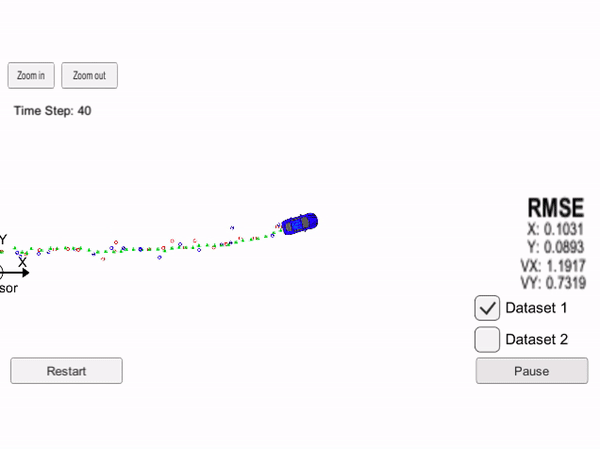

# Extended Kalman Filter Project

This project is part of the Self-Driving Car Engineer Nanodegree Program

In this project I built an extended Kalman filter to estimate the state of a moving object of interest with noisy lidar and radar measurements. 

I was successful in obtaining RMSE values that are lower than 0.1 along the cartesian axes position measurements, and less that 0.5 in velocity components along axes. 

### Accuracy

TODO

### Algorithm implementation

* Your Sensor Fusion algorithm follows the general processing flow as taught in the preceding lessons.
* Your Kalman Filter algorithm handles the first measurements appropriately.
* Your algorithm should use the first measurements to initialize the state vectors and covariance matrices.
* Your Kalman Filter algorithm first predicts then updates.
* Upon receiving a measurement after the first, the algorithm should predict object position to the current timestep and then update the prediction using the new measurement.
* Your Kalman Filter can handle radar and lidar measurements.

### Code Efficiency

### Misc

TODO:
1. While we're giving this project to you with starter code, you are not actually required to use it! If you think you can organize your Kalman Filter better than us, go for it! Also, this project was templatized in an object-oriented style, however it's reasonable to build a Kalman Filter in a functional style. Feel free to start from scratch with a functional algorithm!
2. Keep in mind that your code must compile. If your changes necessitate modifying CMakeLists.txt, you are responsible for ensuring that any reviewer can still compile your code given the dependencies listed earlier in the instructions - platform specific errors will not be debugged by graders.
3. There is some room for improvement with the Kalman Filter algorithm. Maybe some aspects of the algorithm could be combined? Maybe some could be skipped under certain circumstances? Maybe there are other ways to improve performance? Get creative!
4. Analyze what happens when you turn off radar or lidar. Which sensor type provides more accurate readings? How does fusing the two sensors' data improve the tracking results?

## Running the simulator

This project involves the Term 2 Simulator which can be downloaded [here](https://github.com/udacity/self-driving-car-sim/releases).

This repository includes two files that can be used to set up and install [uWebSocketIO](https://github.com/uWebSockets/uWebSockets) for either Linux or Mac systems. For windows you can use either Docker, VMware, or even [Windows 10 Bash on Ubuntu](https://www.howtogeek.com/249966/how-to-install-and-use-the-linux-bash-shell-on-windows-10/) to install uWebSocketIO. Please see the uWebSocketIO Starter Guide page in the classroom within the EKF Project lesson for the required version and installation scripts.

Once the install for uWebSocketIO is complete, the main program can be built and run by doing the following from the project top directory.

1. mkdir build
2. cd build
3. cmake ..
4. make
5. ./ExtendedKF

Tips for setting up your environment can be found in the classroom lesson for this project.

Note that the programs that need to be written to accomplish the project are src/FusionEKF.cpp, src/FusionEKF.h, kalman_filter.cpp, kalman_filter.h, tools.cpp, and tools.h

The program main.cpp has already been filled out, but feel free to modify it.

Here is the main protocol that main.cpp uses for uWebSocketIO in communicating with the simulator.

**INPUT**: values provided by the simulator to the c++ program

["sensor_measurement"] => the measurement that the simulator observed (either lidar or radar)

**OUTPUT**: values provided by the c++ program to the simulator

["estimate_x"] <= kalman filter estimated position x

["estimate_y"] <= kalman filter estimated position y

["rmse_x"]

["rmse_y"]

["rmse_vx"]

["rmse_vy"]

---

## Other Important Dependencies

* cmake >= 3.5
  * All OSes: [click here for installation instructions](https://cmake.org/install/)
* make >= 4.1 (Linux, Mac), 3.81 (Windows)
  * Linux: make is installed by default on most Linux distros
  * Mac: [install Xcode command line tools to get make](https://developer.apple.com/xcode/features/)
  * Windows: [Click here for installation instructions](http://gnuwin32.sourceforge.net/packages/make.htm)
* gcc/g++ >= 5.4
  * Linux: gcc / g++ is installed by default on most Linux distros
  * Mac: same deal as make - [install Xcode command line tools](https://developer.apple.com/xcode/features/)
  * Windows: recommend using [MinGW](http://www.mingw.org/)

## Basic Build Instructions

1. Clone this repo.
2. Make a build directory: `mkdir build && cd build`
3. Compile: `cmake .. && make` 
   * On windows, you may need to run: `cmake .. -G "Unix Makefiles" && make`
4. Run it: `./ExtendedKF `

