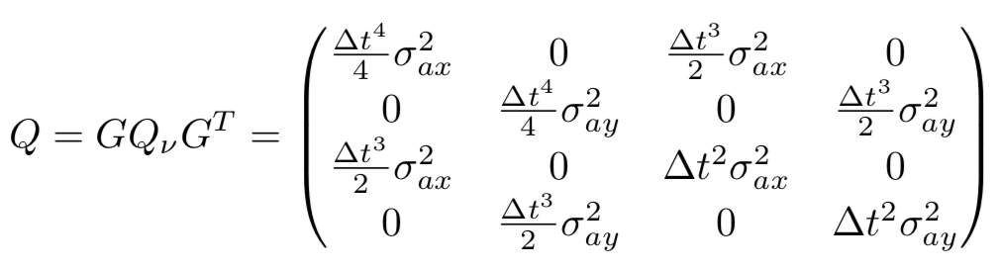

# Extended Kalman Filter Project

|  |
|:--:| 
| *Simulation of LIDAR (red) and RADAR (blue) measurements along with the EKF posterior mean (green)* |

This project is part of the Self-Driving Car Engineer Nanodegree Program

In this project I built an extended Kalman filter to estimate the state of a moving object of interest with noisy LIDAR and RADAR measurements. 

I was successful in obtaining RMSE values that are lower than 0.1 along the cartesian axes position measurements, and less that 0.5 in velocity components along axes. 

### Accuracy

Running the simulations with the ekf yields the following RMSE values:

**Dataset 1:**
* X: 0.0973
* Y: 0.0855
* Vx: 0.4513
* Vy: 0.4399

**Dataset 2:**
* X: 0.0740
* Y: 0.0963
* Vx: 0.4463
* Vy: 0.4752

### Algorithm implementation

Upon receiving a measurement `FusionEKF.ProcessMeasurement()` is called. We first check whether the EFK has been initialized. If not, we set the initial state estimate to be equal to the first measurement and the covariance is initialized to be large. 

If the first measurement is a radar measurement, we need to convert from polar coordinates to cartesian coordinates: 

Once the EKF has been initialized measurements received trigger the following sequence: 

#### Prediction:
First we compute the time difference since the last measurement was received. This is used to compute the state transition matrix F, and the process covariance matrix Q:

Where sigma_ay^2 and sigma_ax^2 is the variance of the acceleration, modelled as gaussian noise with zero mean.

Using `ekf_.Predict()` we apply the prediction equations to update the state estimate and state covariance matrix:

#### Update LIDAR:
Following the prediction step we run the update step to compute the posterior state estimate x and covariance matrix P. If the measurement received was a LIDAR measurement we simply use the plain Kalman Filter update equation to compute the posterior mean and covariance using `ekf_.update()`:

Where z is the measurement received, H defines the mapping from the state space to the measurement space for the LIDAR sensor (stored as `H_` and initialized in the `FusionEKF` constructor), R is the measurement covariance matrix of the LIDAR sensor (LIDAR measurement noise is modelled as a multivariate Gausian with zero mean). R is stored as `R_laser_` and initialized in the `FusionEKF` constructor.

#### Update RADAR:

If the measurement is a RADAR measurement, we will need apply the EKF equations in the update step, as the measurement is given in polar coordinates rather than cartesian coordinates, and the transformation between the two spaces is a non-linear function. The EKF update equations used are mostly the same as above, but we replace `y = z - Hx'` with `y = z -h(x')`, where h(x) is defined as:

.png "State space to measurement space function for radar")

We also replace `H` in the KF equations with `Hj`, the Jacobian. `Hj` is the linear approximation of the mapping from the state space to the measurement space for RADAR measurements. We compute the jacobian `Hj_` for the RADAR measurement using `tools.CalculateJacobian(ekf_.x_)`:

 
Since several elements in the Hj matrix have a denominator which can be 0 or close to zero, we need to ensure that our algorithm can handle those situations. We do this by checking whether px^2 + px^2 is small, and in those cases we simply use the jacobian that was used in the last update. 

Once the Jacobian has been computed, we update the state estimate `x_` and covariance `P_` using `ekf_.updateEKF()` letting `R_radar` be:

---
## Running the simulator

This project involves the Term 2 Simulator which can be downloaded [here](https://github.com/udacity/self-driving-car-sim/releases).

This repository includes two files that can be used to set up and install [uWebSocketIO](https://github.com/uWebSockets/uWebSockets) for either Linux or Mac systems. For windows you can use either Docker, VMware, or even [Windows 10 Bash on Ubuntu](https://www.howtogeek.com/249966/how-to-install-and-use-the-linux-bash-shell-on-windows-10/) to install uWebSocketIO. Please see the uWebSocketIO Starter Guide page in the classroom within the EKF Project lesson for the required version and installation scripts.

Once the install for uWebSocketIO is complete, the main program can be built and run by doing the following from the project top directory.

1. mkdir build
2. cd build
3. cmake ..
4. make
5. ./ExtendedKF

Tips for setting up your environment can be found in the classroom lesson for this project.

Note that the programs that need to be written to accomplish the project are src/FusionEKF.cpp, src/FusionEKF.h, kalman_filter.cpp, kalman_filter.h, tools.cpp, and tools.h

The program main.cpp has already been filled out, but feel free to modify it.

Here is the main protocol that main.cpp uses for uWebSocketIO in communicating with the simulator.

**INPUT**: values provided by the simulator to the c++ program

["sensor_measurement"] => the measurement that the simulator observed (either lidar or radar)

**OUTPUT**: values provided by the c++ program to the simulator

["estimate_x"] <= kalman filter estimated position x

["estimate_y"] <= kalman filter estimated position y

["rmse_x"]

["rmse_y"]

["rmse_vx"]

["rmse_vy"]

---

## Other Important Dependencies

* cmake >= 3.5
  * All OSes: [click here for installation instructions](https://cmake.org/install/)
* make >= 4.1 (Linux, Mac), 3.81 (Windows)
  * Linux: make is installed by default on most Linux distros
  * Mac: [install Xcode command line tools to get make](https://developer.apple.com/xcode/features/)
  * Windows: [Click here for installation instructions](http://gnuwin32.sourceforge.net/packages/make.htm)
* gcc/g++ >= 5.4
  * Linux: gcc / g++ is installed by default on most Linux distros
  * Mac: same deal as make - [install Xcode command line tools](https://developer.apple.com/xcode/features/)
  * Windows: recommend using [MinGW](http://www.mingw.org/)

## Basic Build Instructions

1. Clone this repo.
2. Make a build directory: `mkdir build && cd build`
3. Compile: `cmake .. && make` 
   * On windows, you may need to run: `cmake .. -G "Unix Makefiles" && make`
4. Run it: `./ExtendedKF `

